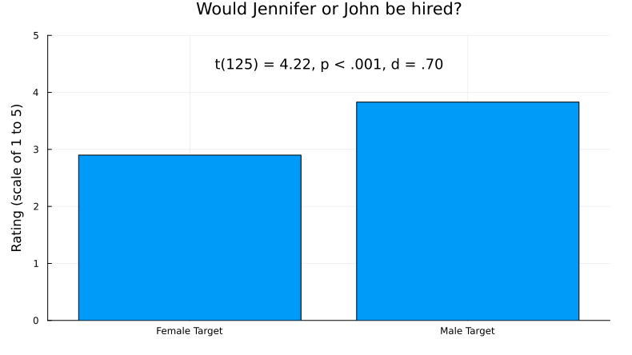
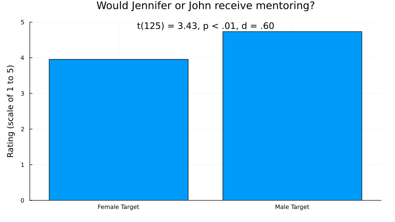
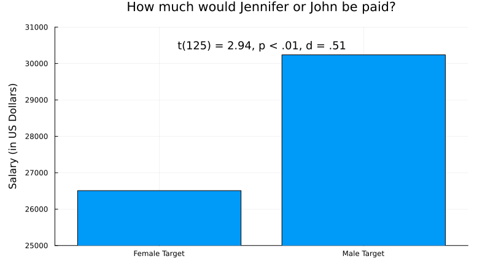
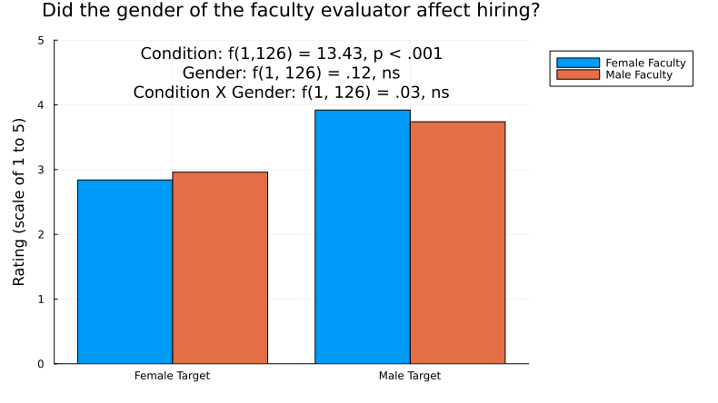
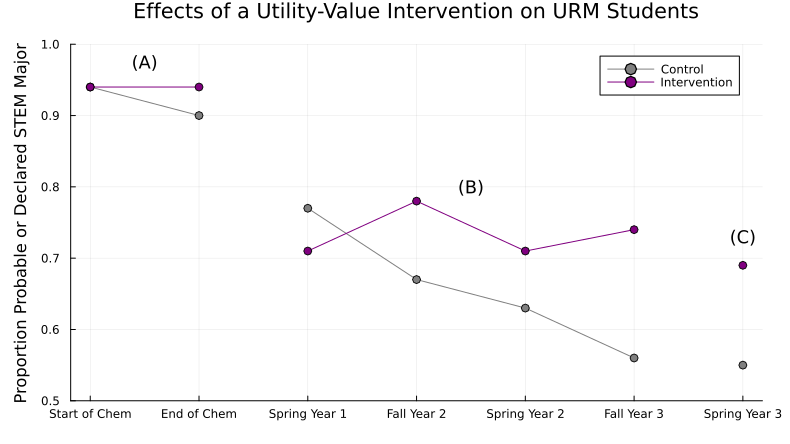

# Inclusive Learning

!!! warning ""
    This site is still under development. Thank you for previewing it! Your feedback is much appreciated -- [Let us know what you think!](https://uwmadison.co1.qualtrics.com/jfe/form/SV_eaCduZfaBtfNpRA)

```@raw html
<!-- TODO insert vignette videos from Sarah K here -->
```

---
## Module Goals

In this module, we hope you will...

- Commit to one action you could take toward sharing your identity in your course. 
- Commit to one action you could take to mitigate the negative impacts of biases and assumptions in your course. 
- Commit to one action you could take to mitigate the negative impacts of stereotype threat in your course. 
- Commit to one discrete and one systemic action you could take to promote a positive sense of belonging in your course.
- Commit to one action you could take to ensure students engage in the facets of science.
- Commit to one action you could take to create a productive failure experience in your course. 

---
## Inclusive Learning Defined

!!! compat ""
    `NOTE: This content was restructured recently. Its objectives need to be rewritten.`

Inclusive learning encompasses the strategies, structure and climate of a learning environment. An inclusive learning environment is one in which students feel a sense of belonging, value, and respect, and are provided with the necessary resources and opportunities to actively learn.

---
## Why Inclusive Learning

!!! compat ""        
    - Explain why inclusive learning environments matter.
    - Identify actions an instructor can take to create inclusive learning environments.
    - Understand key concepts and principles:
        - Inclusive learning environments lead to persistence and diversity in STEM.
        - Inclusive learning environments come from inclusive teaching practices.

Diversity in STEM starts with inclusive learning environments. There is no shortage of proven inclusive teaching methods; in fact the number of choices can be overwhelming. Moreover, who we are as people also influences the learning environment. 

This module provides a supplement to the many examples woven into the rest of the Scientific Teaching Course. It distills several key evidence-based practices, contextualizes them for college STEM courses, and gives you the chance to evaluate how to apply them in your course. You will also explore your identity, biases, and assumptions and consider how they influence who feels included or excluded in your course.

```@raw html
<!-- 
### Achieve STEM diversity: Fix the Classrooms, Focus on what instructors can do

`TODO maybe just make the table in text directly?`

`TODO add a distillation sentence`


Image source: [handelsman_achieving_2022](@cite)
-->
```

---
## A Framework for Inclusive Learning

!!! compat ""    
    `NOTE: This content was restructured recently. Its objectives need to be rewritten.`


Figure adapted from [bell2016design,marchesani1992dynamics](@cite).

Recall the five dimensions to inclusive teaching:

- **Instructor--Who we are:** Be aware of how our social, emotional, and pedagogical perspectives shape how we teach.
- **Students--Who we teach:** Plan meaningful interactions when we are aware of the many dimensions of our students.
- **Curriculum--What we teach:** Choose diverse content, perspectives and contexts with students’ needs and backgrounds in mind.  
- **Pedagogy--How we teach:** Impact learning by implementing evidence-based teaching practices and creating engaging activities with aligned assessments. 
- **Climate--How the class is designed:** Create an environment that enriches student learning through supportive structure and peer connections.

Knowing more about our students helps us develop effective learning goals and teaching approaches, enabling us to plan meaningful interactions. Likewise, developing self-awareness helps us recognize how our biases, assumptions, experiences, and backgrounds shape our teaching methods and highlights areas for personal growth.

---
## Inclusive Learning in Practice

### The Instructor Dimension

```@raw html
<!--
### Share Your Identity

!!! compat ""    
    - Examine your identities.
    - Predict how instructor identities influence student outcomes.
    - Decide which identities to share.
    - Understand key concepts and principles:
        - Your identity influences the classroom learning environment.
        - The first step is to be aware of them.

 `TODO wheres the data?` -->
```

    `TODO: Add scientific/ STEM/ disciplinary identity.`

**Social identity** is defined as the sense of self that comes from membership in a social group (or groups) along with the "value and emotional significance attached to that membership" (Tajfel, 1981. p. 255). For example, identifying as queer also means identifying with current and historical discrimination against members of the queer community.

Social identity is not always fixed and can change over time and between contexts (Gee, 2000).

Additionally, individuals usually have multiple social identities that intersect with each other, producing unique experiences in which some identities privilege the individual and some identities oppress them.

Similarly, **teacher identity** is defined as "the ways teachers make sense of themselves and the images they present to others" (Yuan & Liu, 2021, p. 2). It encompasses how instructors perceive themselves and how they construct their professional identities within educational settings.

Like social identity, instructor identity is dynamic and "negotiated through experience and the sense that is made of that experience" (Sachs, 2005, p.15).

Social identities and instructor's professional identities (Rus et al., 2013; Peterson et al., 1999) can include:

```@raw html
<figure>
    <figcaption>
        <p><strong id="table3-label">Table 3. Social and Instructor Identities</strong><br><span id="table3-summary"><!-- TODO: Description here. --></span></p>
    </figcaption>
    <table aria-labelledby="table3-label" aria-describedby="table3-summary">
        <tr>
            <th scope="col">Social Identities</th>
            <th scope="col">Instructor Identities</th>
        </tr>
        <tr>
            <td>Race/ethnicity</td>
            <td>Educational background</td>
        </tr>
        <tr>
            <td>Gender and sexual orientation</td>
            <td>Prior experience</td>
        </tr>
        <tr>
            <td>Socioeconomic status</td>
            <td>Work-related interests (e.g., academic and research interests)</td>
        </tr>
        <tr>
            <td>Age</td>
            <td>Work style</td>
        </tr>
        <tr>
            <td>Religion</td>
            <td>Skills and abilities (e.g., social skills)</td>
        </tr>
        <tr>
            <td>Ability status</td>
            <td></td>
        </tr>
        <tr>
            <td>Veteran status</td>
            <td></td>
        </tr>
        <tr>
            <td>Mental health or trauma</td>
            <td></td>
        </tr>
    </table>
</figure>
```

### Impacts of Identity

Identity can significantly influence the course climate.

Why? Instructors and students both bring many identities to the classroom, and these identities influence how people choose to present themselves, communicate with others, and engage with the content.

These social dynamics and interactions shape the classroom environment and affect how students experience the learning space. Instructors who choose to share their social and/or professional identities send a message to students that it is also okay for them to share their identities in the classroom, be their authentic self, and bring all of who they are to their work.

Further, the identities that an instructor presents or that are perceived by students impact students' motivation, engagement, and sense of belonging.

For example, instructors who are approachable, open-minded, and understanding can create a safe space where students feel comfortable expressing their opinions and asserting themselves. Instructors who openly value and bring diversity, inclusion, and cultural awareness into their teaching demonstrate to students that diversity is respected and encouraged.

Through sharing and thoughtful integration of one's identities into the course, instructors can cultivate positive relationships with their students, leading to enhanced learning outcomes, a sense of belonging, and persistence in STEM (Estrada et al., 2011).

!!! tip ""
    #### Reflect on Identity in Teaching Contexts

    *Answer in your workbook:*

    Take a few minutes to reflect on your various social and professional identities. You can use the items listed below as a starting point:

    - Social Identity: race/ethnicity, gender and sexual orientation, socioeconomic status, age, religion, ability status, veteran status, mental health or trauma
    - Instructor Identity: educational background, prior experience, work-related interests, work style, skills and abilities

    Then, answer this question: What is, and how would you describe, your identity in teaching contexts?
    
    You may pick a few ideas below to help guide you in answering that question:
    
    - Consider how you see your role as an educator (e.g., only covering content, thinking about student learning and engagement, ensuring all students are included)
    - Consider what has been your previous teaching experience and how it has shaped your teaching philosophy
    - Consider your teaching strengths and weaknesses
    - Consider the role diversity, equity, and inclusion do or don't play in your teaching, and why

Your identity matters. Consider the identities that you bring to the learning environment and how they influence your perspectives and the learning environment.

!!! note ""
    #### Reflect on Your Identities

    What identities do you bring to the learning experiences and interactions within that course?

    Write down, on a separate piece of paper for privacy, your:

    - Full name
    - Race
    - Ethnicity
    - Gender identity and sexual orientation
    - Veteran status
    - Educational path
    - Family’s socioeconomic status
    - Health (mental and physical)
    - Family situation and/or relationship status
    - Circle of friends
    - Hobbies or interests
    - Financial situation

    Do you tell your students these attributes? Why or why not?

    Do you think your students’ attributes are similar to yours? How could you find out?

    How do you think these attributes influence your perspectives about student learning and who is or isn’t included in learning?

!!! tip ""
    #### Commit to Action: Identity

    *Answer in your workbook:* What is one concrete action you could take toward sharing more about your own identity in your courses?

### Address Biases and Assumptions

!!! compat ""    
    - Examine your biases and assumptions.
    - Predict how biases and assumptions influence student outcomes.
    - Commit to one action you could take to mitigate the negative impacts of biases and assumptions in your course.
    - Understand key concepts and principles:
        - Biases and assumptions influence the classroom learning environment.
        - We all hold biases and assumptions.
        - Biases and assumptions are very difficult to change, but the first step is to be aware of them.

Everyone holds biases, assumptions, and stereotypes about others, which can influence outcomes. For example, biases and assumptions affect how we rate people, which can have consequences for hiring decisions and advancement.

!!! note ""
    #### Hiring Studies

    In one study, $127$ biologists, chemists, and physicists at six top US research universities received a student resume that was randomly assigned a gendered name: “Jennifer” (female) or “John” (male). Otherwise, the applications were identical, and each evaluator saw only one version of it. Evaluators then reviewed the credentials of the applicant and decided whether to hire or not.

    The researchers asked the scientists questions about the student candidate:

    - Would you hire them as a lab manager?
    - Do they seem competent?
    - Do you see potential for mentoring?
    - What salary would you offer?

    What results would you predict for that study?

    How do you think the gender, field, age, or tenure status of faculty making hiring decisions mattered?

    !!! details "Click here to find out what happened!"

        How do the results below match your predictions?

        

        

        

        

        From the paper:

        > Faculty gender did not affect bias. Tests of simple effects (all $d < 0.33$) indicated that female faculty participants did not rate the female student as more competent [$t(62) = 0.06$, $P = 0.95$] or hireable [$t(62) = 0.41$, $P = 0.69$] than did male faculty. Female faculty also did not offer more mentoring [$t(62) = 0.29$, $P = 0.77$] or a higher salary [$t(61) = 1.14$, $P = 0.26$] to the female student than did their male colleagues. In addition, faculty participants’ scientific field, age, and tenure status had no effect (all $P > 0.53$). Thus, the bias appears pervasive among faculty and is not limited to a certain demographic subgroup [Moss-Racusin2012-cm](@cite).

        Images source: [Moss-Racusin2012-cm](@cite)

### Reactions to evidence of bias

But you’re a scientist, so you’re not biased, right?

When confronted with the idea that scientists are biased, we have heard:

- “Women and minorities are just too sensitive.”
- “It’s not like that here. Probably it’s like that elsewhere…in Sweden, in the Midwest, at Harvard, at the state university, at the community college, in the Economics Department…”
- “The sample size in the 1988 study was too small.”
- “We’re trained to be objective, so bias studies don’t apply to us.”

Yet study after study demonstrates that we *all* carry biases, assumptions, and stereotypes. 

### Assumptions Matter

```@raw html
<!-- `TODO are there citations for this?` -->
```

Our biases, assumptions, and stereotypes about others can influence outcomes in college or for hiring decisions and advancement.

**Rating Verbal Skills**

When reviewers evaluated a candidate’s written text, their ratings of the candidate’s verbal skills were influenced by the author’s demographics. For example, when reviewers were informed that an African American person had written the text, they rated the candidate’s verbal skills lower compared to when they were told a white person had written it. Similarly, when reviewers were told that a man wrote the text, they evaluated the candidate’s skills more negatively than when they were told a woman wrote it.

**More Hiring Studies**

Dozens of studies have compared hiring decisions with the same setup…

- Identical applications with a male or female name.
- Evaluators review the applicant’s credentials and decide whether or not to hire them. 

…and they all yield the same result: Evaluators are substantially more likely to hire if an applicant has a man’s name.

**This result has not changed for $50$ years.**

Beyond gender: Studies with members of groups other than white, heterosexual, cis-gendered, able-bodied men yield similar results.

!!! note ""
    #### Reflection on Bias in STEM

    What other biases have you seen or experienced in STEM higher education? 

### Actions to Mitigate Bias

```@raw html
<!-- `TODO wheres the data?` -->
```

Awareness:

- **Catch yourself:** Whose answers do you dismiss or talk over? When a woman or person of color responds, what initial reaction do you have to their point of view?
- **Collect data:** How often do you call on the students in the front row? Which demographic groups tend to get the highest grades? Which students do you give constructive feedback?
- **Catch others:** When do they dismiss or talk over someone?

Actions:

- **Call out:** When someone dismisses another, use your voice to return the conversation to the dismissed person. “Jasmine has a point. I’d like to hear more.” “You are restating what Amir said.” 
- **Be an ally:** Use preferred pronouns and gender-neutral pronouns. Add a statement about bias and assumptions to your syllabus. Complete the [Inclusive STEM Teaching Project course](https://www.inclusivestemteaching.org/). If you are ready to be an ally, complete [Safe Zone training](https://thesafezoneproject.com/learn/) and put a Safe Zone sticker on your office door. 
- **Grade fairly:** Remove subjectivity in grading due to bias by using a well-defined rubric that makes clear how competencies are scored. Instructors can also grade anonymously, ranodmize the order of grading, and grade question by question instead of assignment by assignment.

Set a tone for your class and reinforce it:

- **Signal expectations and values:** “In this class, everyone’s voice matters.”
- **Find out more:** Ask students what they need and want. 
- **Equip students:** Provide them with the language and tools they need to mitigate bias.
- **Check in:** Do a “bias check” every month. “Have you seen an act of bias or assumptions in this class with negative repercussions? Was it resolved? What needs to be addressed?” Act on the requests.

!!! tip ""
    #### Commit to Action: Mitigate Bias

    *Answer in your workbook:* What is one concrete action you can commit to taking to mitigate the negative impacts of biases and assumptions in your course?


### The Student Dimension

```@raw html
<!-- `TODO wheres the data?` -->
```

Who are your students? Who feels like they belong in your class or in STEM? How can you find out?
    
You might have students…

- Fill out anonymous surveys before, during, and at the end of the course with questions about scientific self-efficacy, identity, values orientation, and persistence intentions. Compare results across the semester.
- Bring an item to class that represents how they see themselves with respect to science and discovery. 
- Find an image online that represents what they want to get out of your course and share with the whole class, for example through Jamboard or Padlet.
- Share one thing science-related fact about their lives (favorite science fact, most science-y hobby, why they are interested in science).

### Create a sense of belonging in STEM

!!! compat ""    
    - Examine how your course might create or preclude a sense of belonging.
    - Predict how belonging influences student outcomes.
    - Commit to one discrete and one systemic action you could take to promote a positive sense of belonging in your course.
    - Understand key concepts and principles:
        - The classroom learning environment influences the extent to which student feel a sense of belonging.
        - Belonging affects outcomes and persistence in STEM.

Historically excluded communities (HECs) refer to groups of individuals who have traditionally been denied full rights, privileges, and opportunities in STEM education, including but not limited to women, people of color, caregivers, LGBTQIA+ students, first-generation students, and low-income students. These groups have traditionally been underrepresented or excluded from participating in STEM. See also [Asai2020-bb](@cite).

The differential pattern of exclusion from STEM affects students not only according to race and ethnicity; talented college students from HECs leave at higher rates [thiry_talking_2019](@cite). 

Most of those who leave have the interest, confidence, and aptitude to be successful in STEM, but early classroom experiences can dampen their interest and actively exclude them from persisting [thiry_talking_2019,estrada_influence_2019](@cite).

Their departures after gateway STEM courses represent a major talent drain from the system. 

To achieve an equitable educational enterprise, we must address the structural, individual, intentional, and unintentional biases that discourage HEC students from pursuing STEM.

### Actions to foster belonging in STEM

Several interventions have demonstrated promise in increasing college students’ persistence in STEM [estrada_toward_2011](@cite). These interventions often have especially positive effects on HEC students [evans_functional_2021,hurtado_diversifying_2009,olson_expression-based_2019,rodenbusch_early_2016,shuster_implementing_2019,waddell_flying_2021](@cite).

```@raw html
<!-- `TODO use full sentence for these bullet points` -->
```

**Discrete interventions** are defined as individual activities embedded within a course. Example interventions that have been shown to lead to positive student outcomes include:

- Active-learning strategies [freeman_active_2014](@cite)
- Statements that increase students’ sense of belonging with microaffirmations [estrada_influence_2019](@cite)
- Activities that increase resilience by reframing social adversity as common and transient [walton_brief_2011](@cite)
- Exercises that demonstrate the relevance of a course by making explicit its utility value [harackiewicz_closing_2016](@cite) (Asher et al., 2023; Harackiewicz et al., 2016).

**Systemic interventions** modify overall course structure. Some approaches that have proven effective include:

- High-structure course design [freeman_increased_2011,theobald_active_2020](@cite)
- Course-based undergraduate research experiences (CUREs) [aikens_race_2017,dolan_guide_2021,hurtado_diversifying_2009](@cite)

### A framework to gauge belonging

The Tripartite Integration Model of Social Influence (TIMSI) provides a framework for understanding the psychological mechanisms linking educational experiences and persistence outcomes [estrada_toward_2011](@cite). The TIMSI describes three orientations that predict persistence in STEM. 

- **Scientific self-efficacy** indicates that a student feels capable of performing the actions needed to be successful in a STEM course, major, or career. 
- **Scientific identity** indicates that a student perceives science as part of their identity and feels they belong to a scientific community. 
- **Students internalize scientific values** when they authentically agree with the values of the scientific community, such as building new knowledge to solve global challenges, the thrill of discovery, and the importance of discourse.

According to the TIMSI, each of these three factors — independently and collectively — contribute to social integration into STEM communities. Social integration (or persistence) is defined as the intent to pursue further academic or career goals in STEM, or as behaviors, such as submitting applications for graduate school.

!!! tip ""
    #### Commit to Action: Promote Belonging

    *Answer in your workbook:* What is one discrete and one systemic action you can commit to taking to promote a positive sense of belonging in your course?


### The Curriculum Dimension

!!! compat ""
    - Considering the principles of Universal Design, determine how you will make your course accessible and inclusive.

```@raw html
<!--

By adopting the principles of Universal Design, an instructor can build an inclusive course from the outset.

**Universal Design for Learning (UDL)** is a *framework for designing and delivering flexible, inclusive, and accessible learning experiences that can be customized to meet the needs of all learners*, regardless of their abilities, backgrounds, or learning preferences (CAST, 2018). It is rooted in the principles of **Universal Design**, which is an approach to creating products, environments, and experiences that are **usable by as many people as possible without the need for adaptation or specialized design**. UDL is based on the idea that learning should be engaging, relevant, and responsive to individual needs. Importantly, **UDL aims to change the design of the environment rather than to change the learner.**

**Universal Design for Learning (UDL)** *places accessibility at the forefront and leverages various AJEDI principles* for improving teaching and learning for all students. To help implement UDL in the classroom, the Center for Applied Special Technology (CAST) developed the **UDL Guidelines** (CAST, 2018). These are *a set of principles and strategies that aim to provide equal and inclusive access to learning for all students*, including those with disabilities or diverse learning styles. The guidelines provide specific recommendations for creating flexible and engaging learning environments and materials that can be customized to meet the diverse needs and preferences of all students.

The UDL Guidelines encompass **three key principles:** providing multiple means of (1) Engagement, (2) Representation, and (3) Action and Expression.


### UDL Guidelines: Multiple Means of Representation  

In this module, we will be focusing on the principle of providing **multiple means of Representation.** This principle outlines strategies for creating course materials that provide options for perception, language and symbols, and comprehension.
- **Perception:** *Present information in a variety of formats*, such as visual, auditory, and tactile. Instructors can use this principle to ensure that textbooks, videos, lectures, and other course materials are accessible to all students, including those with disabilities or those who process information differently. By incorporating visual aids, videos, diagrams, and other interactive media, instructors provide multiple ways of representing important information and allow students to choose the means that work best for them.
- **Language & Symbols:** *Use clear, concise, and accessible language and symbols and avoid language or symbols that may be exclusive, biased, or offensive.* This guideline aims to promote understanding and reduce barriers to learning by selecting language and symbols that are familiar and meaningful to all learners. This can be achieved by providing captioning, transcripts, and audio descriptions for multimedia content, incorporating pictures or symbols to represent concepts, and avoiding jargon or complex language whenever possible, and providing alternative means of representation for students with different cultural and linguistic backgrounds.
- **Comprehension:** *Incorporate a variety of instructional techniques to ensure that students can access, process, and assimilate new information and knowledge.* Instructors need to provide supports and scaffold curriculum to help students comprehend the material. This can include activating or providing prior knowledge; providing explicit cues or prompts to emphasize key elements, concepts, and features; embedding scaffolds and feedback to organize and process information; and incorporating opportunities for students to apply their knowledge to new contexts.

For more information on the other two principles, visit the [CAST UDL website](https://udlguidelines.cast.org/).

-->
```


### Structuring for Accessibility

Providing access to resources is **fundamental to addressing inequities**, because it ensures that course structures, artifacts, and the environment do not preclude anyone from learning. However, *the mere existence of a resource* **does not by itself lead to equitable and inclusive outcomes.**

**Accessibility** refers to the *design and creation of products, devices, environments, and content that can be used and accessed by all people*, including those with disabilities or other impairments. The goal of accessibility is to **provide equal access and opportunities for everyone, regardless of their abilities**, so that they can participate fully in all aspects of society. This includes considerations such as physical, digital, and social accessibility.

In the context of education, accessibility refers to the practice of creating learning environments, resources, and technologies that allow all students to access and engage with academic content and participate in learning activities.

- **Physical accessibility:** Make physical spaces and materials accessible, such as by providing wheelchair ramps, captioning videos, and offering alternative formats of textbooks. 
- **Digital accessibility:** Design digital content and technologies that are compatible with assistive technologies, such as screen readers and text-to-speech software.
- **Social accessibility:** Use inclusive language, accommodate different communication styles.

### The Need for Accessibility

Students with disabilities face many challenges when seeking accommodations in higher education (Gin et al., 2020).


An accessible course design **reduces the need for accommodation, alleviates the burden and stigma** associated with students seeking accommodations, **saves time** for educators, and **diminishes the cost** associated with providing individual accommodations. Importantly, accessibility **improves educational outcomes for all learners** by making sure that educational materials and resources are available and usable by everyone, regardless of their individual needs.

Universal Design for Learning (UDL) provides a framework that guides educators to create accessible course materials and flexible and inclusive learning experiences that meet the needs of all learners, regardless of their abilities or background. Why build a course with UDL at the forefront instead of accommodating student needs as they arise? Consider this passage from Rose and colleagues (2006):

>"Such an environmental view fosters solutions that **address the limitations of the learning environment** rather than the limitations of the student, while making the student less of a problem, and **more a part of diversity within the course**. The advantage of such universal solutions is that, as with such approaches in built environments, they are likely to be useful for many individuals; **built once, applied many times.**" (p. 150)

*Individuals with disabilities are highly underrepresented in STEM degree attainment and STEM employment.*

Individuals with disabilities enter postsecondary education at a slightly higher percentage in which they are represented in the general population. Additionally, individuals with disabilities enroll in STEM field majors at the same percentage as individuals without disabilities.


!!! note ""
    #### Invisible Barriers and Inequity

    The image below shows an instructor making an announcement about office hours, and the different responses of his students. What unintentional inequities are revealed in this interaction, and how would you try to offset them? (Yee, 2016)

    

!!! note ""    
    #### Is it Accessible?

    For each of the following pictures and accompanying statements, list the considerations an instructor should address to ensure all students have access to learning. Think about barriers and issues related to the physical space, learning, sensory, communication, chronic health, and mental health.

    

    

    

### The Impact of Accessibility

Studies have shown that using UDL principles and teaching strategies **positively affect students' perception, performance, and engagement in learning.**


Structuring a course using UDL and AJEDI principles positively impacts students, increasing engagement, and empowering students. 


### Show Me the Data!

To determine the possible impact of equity-oriented pedagogy on student learning, researchers recruited $54$ undergraduate students for a treatment group and $59$ students for a control. Equity-oriented pedagogy was defined as using specific components of democratic, assessment-driven, strengths-based, multimodal, and game-based pedagogies. Instructors in the treatment group applied the equity-oriented pedagogy, using student data and feedback to adjust instruction, while instructors for the control group used a standard pedagogy and no data/feedback.

The researchers found statistically **significant differences on the final assessment scores** in favor of students who were in the treatment classroom ($p < .0001$). Students in each group answered questions before each lesson (pre) and at the end of each lesson (post). These scores each week are shown in Figure 1. **Students in the treatment group consistently outperformed those in the control group** (Phuong et al., 2017).


!!! note "" 
    **Evaluate the Data Yourself**

    A curriculum called i-NATURE (Indigenous integration of Aquatic sciences and Traditional Ecological Knowledge for Undergraduate culturally Responsive Education) is a culturally relevant, project-, and place-based curriculum that includes extensive applied research experience contextualized for specific Indigenous communities. Researchers tested whether implementation of the i-NATURE curriculum improved retention and learning outcomes for the students who participated (Alexiades et al., 2021).

    

    

    What conclusions can you draw from the data shown above? (Check all that apply.)

    - The i-NATURE program had no effect on annual percentage retention or mean course GPA
    - There is a statistically significant difference in mean course GPA for students after participating in the i-NATURE program
    - Participating in the i-NATURE program did not significantly change the annual percentage retained
    - Participating in the i-NATURE program did not significantly change the mean GPA of students
    - There was 100% retention in the Environmental Science and Studies Programs for students participating in the i-NATURE program

!!! tip ""
    #### Commit to Action: UDL

    *Answer in your workbook:* Describe one specific aspect of universal design that you can commit to implementing in your course to enhance accessibility.

### Connect Facets of Science with Inclusive Learning

!!! compat ""    
    - Examine how your course provides students with access to the facets of science.
    - Predict how experiencing the facets of science influences student outcomes.
    - Commit to one action you could take to ensure students engage in the facets of science. 
    - Understand key concepts and principles
        - The facets of science provide a framework for engaging students in learning science authentically.
        - Students who engage in authentic science practices are more likely to persist in STEM.
        - Just one CURE in college can increase persistence in STEM.

When students actively participate in the facets of science, we see:

- Improved scientific self-identity and efficacy
- Increased belonging
- Persistence in STEM degrees and careers
- Increased STEM accessibility for students with health conditions or impairments
- Positive gains for all students with additional gains for students who are members of HEC groups

These outcomes lead to diversity in the STEM workforce and and informed citizenry.

Source: [estrada_toward_2011](@cite).

### Preparing for the first day of class

Instructors might consider collaborating with various colleagues or resources as they design their course to meet accessibility and UDL guidelines. For example, instructors could consult with:

- Staff at the university's center for teaching and learning
- Staff at the university's disability services office Diversity, Equity, and Inclusion (DEI) specialists
- Teaching assistants
- Technology specialists

!!! note ""
    #### Evaluate the way this instructor uses UDL principles on their first day of class
    
    Review the following slides from an introductory biology class for nonmajors (asynchronous and online). What elements from the UDL Guidelines are present? Additionally, how could the slides be improved?

    `TODO: add slides`

### The Pedagogy Dimension

    `TODO: This section needs to be broader.`

**Instructor immediacy** is "the extent to which communication behaviors enhance closeness to and nonverbal interaction with another" (Mehrabian. 1969, p. 203) as well as behaviors that reduce distance between teacher and student (Andersen, 1979).

**Instructor presence** is the degree to which instructors are actively involved in the learning environment, including how the course is designed, organized, and managed as well as how the learning is facilitated (Garrison et al., 1999).

Research has shown many positive outcomes from engaging in instructor immediacy and presence practices:

- There is a significant relationship between instructor immediacy and student affective and cognitive learning (Andersen et al., 1981).
- When instructors exhibit behaviors related to instructor presence, students report high levels of learning and community (Shea et al., 2006).
- Student affective learning, cognition, and motivation are significantly and positively correlated to instructor immediacy and presence (Baker, 2010).

Examples of instructor immediacy (Andersen et al., 1981) and presence (Arbaugh & Hwang. 2006) include:

- Instructor Immediacy:
    - Maintain closer physical distance
    - Use direct body orientation
    - Use eye contact
    - Engage in positive body movements such as nods and smiles
- Instructor Presence:
    - Communicate goals
    - Set guidelines for student interaction
    - Encourage student participation
    - Ensure students don't feel isolated

!!! note ""
    #### Instructor Immediacy and Presence

    Match each of the following interactions to either "Instructor Immediacy" or "Instructor Presence."

    - Addressing students by their preferred names
    - Providing clear instructions and guidance for course assignments
    - Participating actively in discussion forums and online chats
    - Expressing nonverbal cues to show interest and attention
    - Making regular announcements and updates to the course content
    - Using humor during lectures or in interactions with students


### The Climate Dimension

What is Course Climate?

```@raw html
<!--
In the opening activity, we saw how an email can communicate what the course will look like and forecast details about the instructor.
 `TODO "in the opening activity" -- which one?`
-->
```

Before the semester even starts, a student may feel intimidated or start doubting their ability to succeed. All students have the right to an education and should be given the tools and space to engage and learn. What can we do as educators to help all students succeed?

One of the first steps we can take is to be intentional in the ways we set up our course. In particular, we can influence the course climate--the overall learning environment in a classroom or educational setting--to be more inclusive (Dewsbury & Brame, 2019). An inclusive course climate is one where all students feel welcome, valued, and supported regardless of different backgrounds and identities (Brame. 2019).

### Hot or Cold or Just Right?

Because course climate is a somewhat abstract concept, we will use an analogy to help us understand it more deeply: temperature.

A common phrase associated with group spaces is "taking the temperature of a room," which means assessing and gauging the emotional or social atmosphere of a situation or group of people. It involves observing the general mood, attitudes, and reactions of individuals in a group to determine how they are feeling and what their overall response is to a situation or idea.

- 🔥 **Hot:** The atmosphere is charged, tense, or hostile. It could also indicate that the individuals in the room are passionate or enthusiastic about a particular topic or idea, which can make others feel anxious or apprehensive about engaging. Students may engage in dismissive, disruptive, or disrespectful behaviors. The classroom environment may be overtly hostile to students based on race, gender, socioeconomic or other status, ability, or other demographic factors.
- 🧊 **Cold:** The atmosphere is unfavorable, unfriendly, or unwelcoming. The individuals in the room may be unresponsive or uninterested in the topic or discussion being presented. Students may withdraw from participating in activities or attending class altogether. The classroom environment may be covertly hostile to students based on race, gender, socioeconomic or other status, ability, or other demographic factors.
- ⚖️ **Just Right:** The atmosphere is collaborative, collegial, and supportive. It suggests that the individuals in the room are receptive and engaged, and conversations are respectful and inquiry-based. Diverse perspectives are encouraged and considered. This type of room temperature correlates with a respectful buzz of engagement, where everyone feels their voice is heard, their insights are valid, and their questions are welcome.

```@raw html
<!-- `TODO where's the data on how well (or not well) we can accurately gauge these things in a real setting? across cultures? etc.?` -->
```

!!! note ""
    #### Reflect on Course Temperatures

    Recall times when your courses -- when you were a student -- felt "Hot," "Cold," or "Just Right." Try to describe a few examples of each.

    Then reflect:

    - What all do you think contributed to making those courses feel that way?
    - How did it impact your learning experiences in that course?
    - Did any course have a mix of "Hot," "Cold," or "Just Right" days?
    - Did any course feel at times "Just Right" to you, but "Hot" or "Cold" to your peers?

### Impacts of Course and Campus Climate

The perception of being unwelcome in the college classroom was termed "chilly climate" by Hall and Sandler (1982) and then later expanded to include the campus environment (1984). Studies have shown that both course and campus climate affect many aspects related to a student's educational experience.

```@raw html
<figure>
    <figcaption>
        <p><strong id="table4-label">Table 4. Impacts of Course and Campus Climate</strong><br><span id="table4-summary"><!-- TODO: Description here. --></span></p>
    </figcaption>
    <table aria-labelledby="table4-label" aria-describedby="table4-summary">
        <tr>
            <th scope="col">Unwelcoming Environment</th>
            <th scope="col">Welcoming Environment</th>
        </tr>
        <tr>
            <td>Negative cognitive outcomes for women (Pascarella et al. 1997)</td>
            <td>The strongest predictor of academic competence is perception of the campus environment as supportive (Reason et al., 2006)</td>
        </tr>
        <tr>
            <td>Negative effects on Latino students' sense of belonging (Hurtado & Carter 1997)</td>
            <td>Students who are more engaged and more comfortable are significantly more likely to persist in STEM (Barthelemy et al., 2015)</td>
        </tr>
        <tr>
            <td>Non-white students find the campus climate chillier than white students (Morris & Daniel, 2008)</td>
            <td>Kindness cues affirm social inclusion, especially for underrepresented students (Estrada et al., 2018)</td>
        </tr>
        <tr>
            <td>Negatively affects minority students' academic/ intellectual development, social experiences, and institutional commitment (Cabrera et al. 1999)</td>
            <td>A utility-value intervention demonstrated long-term positive effects such as improved STEM persistence overall, with larger effects for students from underrepresented minority groups [asher2023utility](@cite)</td>
        </tr>
        <tr>
            <td>Lower perceived gains in academic preparation for women (Pascarella et al. 1997)</td>
            <td>Evidence-based recommendations increase underrepresented minority students' persistence in STEM such as...</td>
        </tr>
        <tr>
            <td>Students of color perceive the campus climate as more racist and less accepting than white students (Rankin & Reason. 2005)</td>
            <td>...connecting class content to personal and culturally valued outcomes (Estrada et al., 2016)</td>
        </tr>
        <tr>
            <td>Women find the campus climate chillier than men (Morris & Daniel, 2008)</td>
            <td>...addressing student resource disparities (Estrada et al., 2016)</td>
        </tr>
        <tr>
            <td>Students in traditionally female-dominated majors perceive the campus climate chillier than students in traditionally male-dominated majors (Morris & Daniel, 2008)</td>
            <td>...increasing institutional accountability (Estrada et al., 2016)</td>
        </tr>
        <tr>
            <td>LGBTQ students with disabilities experience isolation, tokenization, and an overall chilly climate (Millter & Downey, 2020)</td>
            <td>...creating strategic partnerships with programs (Estrada et al., 2016)</td>
        </tr>
        <tr>
            <td></td>
            <td>...and using best curriculum practices (Estrada et al., 2016)</td>
        </tr>
    </table>
</figure>
```

### Show Me the Data!

Based on data from $6,687$ first-year students and $5,024$ faculty members from $30$ public and private four-year institutions, analyses identified several student and organizational variables that independently contribute to students' development of academic competence during the first year of college (Reason et al., 2006).

Various performance indicators related to course climate were significantly related to academic competence, such as:

- **Supporting All Students:** Students' perceptions of the supportiveness of the institutional environment ($p < .001$)
- **Cognitive Engagement:** Students' perceptions that coursework emphasizes higher- order cognitive skills ($p < .001$)
- **Academic Engagement:** How often students actively engage in class activities and time spent preparing for class ($p < .001$)
- **Diverse Interactions:** Frequency of, and institutional emphasis placed upon, students' interactions with diverse others and ideas ($p < .001$)

!!! note ""
    #### Utility-Value Intervention 

    Researchers tested the long-term effects of a utility-value intervention administered in a gateway chemistry course [asher2023utility](@cite). A utility-value intervention is a task designed to help students recognize the practical significance and usefulness of the content they are learning, linking it to their own goals, interests, and future aspirations.

    In a randomized controlled trial ($N = 2505$), students either wrote three essays in a Chemistry course about course content and its personal relevance (Intervention), or wrote three control essays (Control).
    
    The figure below shows the percentage of underrepresented minority (URM) students, by condition, who were classified as probable or declared STEM majors over time.

    

    - (A) Reported STEM major at beginning and end of intervention semester. The end-of-semester intervention effect was $p = 0.145$.
    - (B) Took 2 or more STEM courses in each subsequent semester. The effect of the intervention on course taking in the Fall of Year 2 was $p = 0.049$. In the Spring of Year 2, the effect was $p = 0.149$. And in the Fall of Year 3, the effect was $p = 0.007$.
    - (C) Majored in STEM, end of year 3. This was the primary outcome variable. The intervention effect was $p = 0.020$.

    True or False? Overall, the utility-value intervention led to positive outcomes for URM student retention in STEM.

### Understanding Stereotype Threat in STEM Education

!!! compat ""    
    - Examine how your course might activate stereotype threat.
    - Predict how stereotypes influence student outcomes.
    - Commit to one action you could take to mitigate the negative impacts of stereotype threat in your course.
    - Understand key concepts and principles:
        - Stereotype threat influences the classroom learning environment.
        - We all hold stereotypes.
        - Stereotypes are very difficult to change, but the first step is to be aware of them.

Biases and assumptions can manifest as stereotypes, which can lead to a phenomenon known as **stereotype threat**. Stereotype threat occurs when individuals fear they may confirm negative stereotypes about their social group (Steele, Spencer, & Aronson, 2002). This fear can negatively impact their performance, regardless of their actual capabilities, reinforcing the stereotype and creating a self-fulfilling prophecy.

Stereotype threat can arise from negative stereotypes related to any aspect of one's identity, including ethnicity, culture, first-generation status, veteran status, and sexual orientation. In STEM education, this can hinder academic performance and persistence, particularly in underrepresented groups.

**Simply mentioning a stereotype can activate this threat and lead to negative outcomes** [Kumar2010-mp,Stricker2015-ce,Steele2002-pt,Steele1995-bz](@cite).

### Psychological Impacts of Stereotype Threat

Stereotype threat can manifest in various ways, including:

- **Fear of confirming a negative stereotype:** Individuals may feel heightened anxiety and pressure to avoid confirming a negative stereotype, which can impair their performance.
- **Lack of confidence:** The internalization of stereotypes can lead to self-doubt and a belief that they are not capable of performing well.
- **Overcompensation:** In an effort to disprove the stereotype, individuals may place excessive pressure on themselves, leading to increased anxiety.
- **Reduced motivation:** Feeling judged based on group membership rather than individual abilities can diminish motivation and engagement in the task.

Understanding and mitigating stereotype threat is crucial for creating an inclusive and equitable learning environment in STEM, where all students can perform to the best of their abilities without the burden of stereotypes.

### How Might a Science Course Invoke Stereotype Threat?

Science courses might solicit stereotype threat in several ways, often through subtle cues or practices that unintentionally reinforce stereotypes.

- **Creating a competitive classroom environment:** Using language that emphasizes competition or ranking can increase pressure and trigger stereotype threat.
- **Underrepresenting certain groups in course materials:** If a course only features contributions from a narrow demographic (e.g., predominantly white male scientists), it can reinforce the idea that certain groups do not belong or excel in the field.
- **Using language that reinforces stereotypes:** Phrases like "men tend to be better at spatial reasoning" or "women are often less interested in hard sciences" can directly invoke stereotype threat by reminding students of negative stereotypes.
- **Setting different expectations based on stereotypes:** If an instructor unconsciously expects less from students based on their identity (e.g., not calling on women as often in math discussions), it can reinforce stereotypes and impact the confidence and performance of those students.
- **Emphasizing differences rather than similarities:** Highlighting identity-related differences in classroom interactions can make students more aware of their identity in a way that triggers stereotype threat.
- **Assigning or allowing homogenous groups:** If students are often grouped by gender, race, or other identity factors, those in underrepresented groups might feel isolated or under extra pressure to perform.
- **Not addressing social dynamics within groups:** If certain students are consistently sidelined or not listened to in group work due to their identity, it can exacerbate feelings of inadequacy.
- **Teaching content that aligns with gender stereotypes:** For example, focusing on biological differences between men and women in a way that suggests innate ability differences can unintentionally reinforce stereotypes. Using examples or scenarios that are gendered or culturally biased can make students from underrepresented groups feel like they don’t belong or aren’t expected to excel in the subject.
- **Providing different types of feedback based on identity:** For example, giving less critical or less detailed feedback to students from underrepresented groups might unintentionally lower expectations and reinforce stereotypes.

### Strategies to Reduce Stereotype Threat

Here are some strategies you can implement to reduce stereotype threat in the classroom:

- **Emphasize a growth mindset:** Promote the idea that abilities and intelligence can be developed through hard work and perseverance, rather than being fixed traits. This helps students see challenges as opportunities for growth, rather than as threats to their identity.
- **Provide diverse role models:** Invite guest speakers or highlight stories of diverse individuals in STEM fields who share similar backgrounds with your students. This can help students see that success is achievable regardless of their identity.
- **Encourage collaborative learning:** Promote group work and peer collaboration to create a sense of belonging and reduce the pressure on individual performance. Ensure groups are diverse and inclusive, so students can learn from and support each other.
- **Affirm students’ values:** Incorporate value-affirmation exercises, where students reflect on and write about their personal values and why they are important. This can buffer against stereotype threat by reinforcing students' sense of self-worth.
- **Offer constructive feedback:** Give feedback that is specific, actionable, and focused on improvement. Be encouraging and let students know you believe in their potential to succeed.
- **Promote self-reflection:** Encourage students to reflect on their learning process and identify strategies that help them succeed. This can build their confidence and resilience.

!!! tip ""
    #### Commit to Action: Mitigate Stereotype Threat

    *Answer in your workbook:* Describe one concrete action you can take to mitigate the negative impacts of stereotype threat in your course.

### Create Productive Failure Experiences

!!! compat ""    
    - Examine where students implicitly and explicitly learn about failure in your course.
    - Predict how experiencing personal or scientific failure influences student outcomes.
    - Commit to one action you could take to create a productive failure experience in your course. 
    - Understand key concepts and principles:
        - Science and discovery are based on failure.
        - Failure can be personal or scientific.
        - Learning how to fail productively may lead to positive student outcomes.

Science is based on failure:

- All engineering innovation is predicated on failed designs (Petroski 2006).
- Failure is an expected and necessary part of learning and scientific inquiry [simpson_failure_2017](@cite).
- Failure in science can lead to learning to iterate and solve problems (Lopatto et al., 2020; Gin, et al., 2018).

Yet students may not think failure is productive:

- Students conclude that classroom struggles indicate they are not cut out for science (Good et al., 2012; Koch et al., 2008).
- Students have a fear of failure, which is “cognitive and emotional reaction towards environmental stimuli that are apprehended as threats in achievement contexts” (Cacciotti, 2015).
- Fear is antithetical to learning and creativity.
 
### Growth mindset opportunity!

Reframe how you and your students think about the role of failure:

- Instead of: *My experiment failed. I am a failure.*
- Move toward: *What went wrong? How can I change it next time? What can I learn from it?*

### Help students perceive failure as productive

- Hearing only about physicists’ achievements diminished students’ interest in science; learning about their struggles enhanced students’ interest in and recall of key concepts from the course (Hong & Lin-Siegler, 2012). 
- “Struggle stories” increased student motivation and performance, especially among low-performing students [lin-siegler_even_2016](@cite). 
- The “growth mindset” enables students to see a failure as an opportunity for growth rather than an assurance of further failure. (Dweck, 2006; Good et al., 2012; Canning, XX)

### Failure in STEM

```@raw html
<!-- TODO update the framing of this framework as the failure study progresses -->
```

Failure is an essential part of science, yet it, along with resilience, are not explicitly taught. There are two types of failure: personal and scientific. A framework can provide a path for engaging students in failing productively and developing resilience.

Productive Failure Framework:

Personal failure results from:

- Life circumstances
- Personal choices
- Challenging or impossible tasks
- Insufficient effort, practice, or training

Scientific failure results from:

- Technical issues in an experiment
- Data not supporting a hypothesis
- Idea not being accepted by peers

!!! note ""
    #### Reflect on Failure

    Think about where students implicitly and explicitly learn about failure in your course, and identify ways they can experience productive failure.

    Do students learn how to navigate **personal** failures and if so, how? 

    What productive failure opportunities could be included in your course to mitigate negative outcomes related to **personal** failure?

    Do students learn how to navigate **scientific** failures and if so, how? 

    What productive failure opportunities could be included in your course to mitigate negative outcomes related to **scientific** failure?

!!! tip ""
    #### Commit to Action: Experience Productive Failure

    *Answer in your workbook:* What is one concrete action you can commit to taking to create a productive failure experience in your course, or ensuring that students experience their failures in your course as productive?


!!! tip ""

    Commit to one or more mechanisms that will help you create the course climate you want.

---

## An AJEDI lexicon for inclusive learning

!!! compat ""    
    - Know the relevant terms for inclusive learning.
    - Understand key concepts and principles:
        - AJEDI = antiracism, justice, equity, diversity, and inclusion

**Antiracism:** Active efforts to reduce racism that are embodied in behaviors, actions, and policies that lead to racial equity and are substantiated by antiracist ideas. Practicing antiracism requires constantly identifying, challenging, and replacing existing racist acts and policies to foster equity between racial groups.

**Justice:** A concept of fair and just relations between the individual and society. It involves ensuring that power, wealth, education, healthcare, and other opportunities are distributed fairly among individuals regardless of their background. It also means treating people of all races fairly, so that everyone has the same chances and outcomes. Achieving racial justice requires putting systems and measures in place that actively work towards equal treatment and opportunities for people of all races.

**Equity:** The condition in which individuals are provided the resources they need to have access to the same opportunities as the general population. Equity accounts for systematic inequalities, meaning the distribution of resources provides more for those who need them most.

**Diversity:** The myriad of ways in which people differ, including the psychological, physical, cognitive, and social differences that occur among all individuals, such as race, ethnicity, nationality, socioeconomic status, religion, education, age, gender, sexual orientation, marital status, mental and physical ability, immigration status, and learning preferences. Diversity is all-inclusive and supportive of the proposition that everyone and every group should be valued.

**Inclusion:** Authentically bringing traditionally excluded individuals or groups into processes, activities, and decision- and policy-making in a manner that shares power.

[lawrence2004structural,miller_ajedi_2022](@cite)
