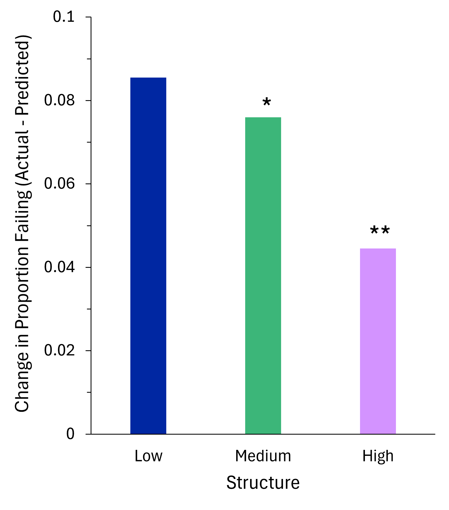

# Course Structure

**Estimated time to complete:** 25 minutes

## Module Learning Objectives

!!! compat ""

    By the end of this module, you will be able to…

    - Describe the idea of course structure and consider how to apply it to your own course.
    - Explain how high-structure course design can support an inclusive learning environment.
    - Practice creating a course map.
    - Create welcome materials for a learner-centered syllabus.

---

## Course Structure Defined

Course structure refers to the organizational system of a course, including the schedule, welcome materials, format, content, communication modes and overall themes. A well-structured course communicates all of these components to students and ensures they have access to each component.

How the course is structured can contribute to making the course inclusive for diverse students. As we structure our courses and plan out the details of our course design, it is also important to consider how we communicate our course design with students through the syllabus and welcome materials.

!!! tip ""

    #### Welcome Emails

    Read Dr. Reyes's and Dr. Wong's "Welcome to Class" emails below, which introduce their courses to their students.

    What do these emails reveal about the class atmosphere and course structure?

    How do you feel after reading these?

    !!! details "Click to show Dr. Reyes's email"

        Dear students,

        I am writing to welcome you to BIO 101 - Introduction to Biology. My name is Emilio Reyes, and I will be your instructor for this course.

        Biology is a complex and fascinating field that requires a disciplined and rigorous approach to learning. Throughout this course, we will
        cover the fundamental concepts of biology, including cell biology, genetics, ecology, and evolution.

        As a student in this course, you will be held to a high standard of academic excellence. You will be expected to attend all class meetings,
        arrive on time, and actively participate in discussions. You must complete all assigned readings and assignments on time and meet all
        deadlines.

        It is essential that you come to this course prepared to learn, work hard, and meet the expectations set forth in the course syllabus.Failure to do so may result in a lower grade or even failure of the course.

        If you have any questions or concerns, please do not hesitate to reach out to me. However, please understand that I expect you to take responsibility for your own learning and to do everything in your power to succeed in this course.

        I look forward to working with you throughout the semester and seeing you meet the expectations of this challenging course.

        Sincerely,

        **Emilio Reyes, Ph.D.**

        University of Universities

        Department of Biological Sciences

        ereyes@school.edu

    !!! details "Click to show Dr. Wong's email"

        Dear students,

        It is my pleasure to welcome you to BIO 101 - Introduction to Biology. My name is Mei Wong, and I will be your instructor for this course. Biology is an exciting and ever-evolving field that explores the diversity of life, the processes that sustain life, and the interactions between living organisms and their environments. Throughout this course, we will cover the fundamentals of biology, including cell biology, genetics, ecology, and evolution. Based on your interests, we will also discuss current issues and challenges facing the field of biology, such as climate change and emerging diseases.

        As a student in BIO 101, you will be part of a diverse and engaging community of learners. You will have the opportunity to work with your peers on group projects, participate in classroom discussions, and engage in case studies.

        To get started, please review the course syllabus and familiarize yourself with the expectations and requirements for the course. It is okay if the last biology course you took was many years ago. We will work together to elicit your prior knowledge and leverage the skills and experiences you have to help you succeed in the course. My goal is to provide a classroom space where you are free to take chances, make mistakes, and learn from each other.

        There is no textbook to purchase, but you will need access to a computer and the internet to read pre-class readings and submit assignments on Canvas (our learning management system). Please email me or speak to me if you have concerns or issues related to access.

        If you have any questions or concerns, please do not hesitate to reach out to me. I am available to meet with you during office hours or by appointment to discuss any course-related topics or questions you may have. My door is also always open if you need guidance or someone to speak to about non-course topics.

        I look forward to meeting you and working with you throughout the semester. Let's make it a great one!

        Best regards,

        **Mei Wong, Ph.D.** (she/her, they/them)

        University of Universities

        Department of Biological Sciences

        mwong@school.edu

### High-structure Course Design

The level of course structure lies on a continuum from low to high. High-structure courses embed multiple opportunities for engagement and frequent assessments, in contrast to low-structure courses that offer fewer (Beck & Roosa, 2020, Freeman et al., 2011). Low-structure courses assume that students know how to efficiently work with course materials in and outside of class. However, many students have not developed effective study strategies or time management skills (Hartwig & Dunlosky, 2012). High-structure courses scaffold student learning with increased engagement and practice. Therefore, they decode the learning process through clear and accessible learning goals and expectations which can be especially helpful for students from HECs (Eddy & Hogan, 2014; Beck & Roosa, 2020). Low structure only benefits students who know how to decode the system. High structure benefits all students (Beck & Roosa, 2020).

```@raw html
<figure>
    <figcaption>
        <p><strong id="table1-label">Table 1. Factors involved in moving from low- to high-structure course design.</strong><br><span id="table1-summary"><!-- TODO: Description here. --></span></p>
    </figcaption>
    <table aria-labelledby="table1-label" aria-describedby="table1-summary">
        <tr>
            <th scope="col">Low Structure</th>
            <th scope="col">High Structure</th>
        </tr>
        <tr>
            <td>No clear learning objectives</td>
            <td>Clear learning objectives</td>
        </tr>
        <tr>
            <td>High-stakes assessments only</td>
            <td>Regular low-stakes reviews</td>
        </tr>
        <tr>
            <td>Uncertainty regarding what and how to study</td>
            <td>Relevant practice and activities</td>
        </tr>
        <tr>
            <td>Low interaction</td>
            <td>High interaction and participation</td>
        </tr>
    </table>
</figure>
```

!!! tip ""

    #### TODO title

    Examine Professor Li's and Professor Garcia's homepages for their Technology and Society courses below.

    What do these homepages reveal about which course is low structure and which is high structure?

    How do you feel after being greeted by these?

    !!! details "Click to show Professor Li's course homepage"

        > # Technology and Society 201
        > ## Prof. Li
        > ### Welcome!
        >
        > Homework and pre-class quizzes should be completed ahead of time to help prepare you for class. During class, there will be plenty of opportunities to interact with peers and for structured practice through clicker questions and case studies. Exit tickets occur every class and are for completion. Weekly quizzes occur on Fridays and will cover concepts learned that week.

    !!! details "Click to show Professor Garcia's course homepage"

        > # Technology and Society 201
        > ## Prof. Garcia
        > ### Welcome!
        >
        > There is no homework in this class; practice problems can be found at the end of each textbook chapter. Your grade will be determined by two mid-term exams and a final exam. There are no makeups for exams, unless there is a valid university-approved

!!! tip ""

    #### Comparing Course Structures

    Examine [these example course structures](assets/course-structures.html) that describe one week of two different courses, Course 1 and Course 2.

    Which example course structure resonates with your experiences as a student? Why?

    Which example course structure looks more learner-centered? Why?

    *Call to mind a course you are teaching, have taught, or are planning to teach.*

    Which example course structure looks more like yours? Why?

---

## Why Course Structure?

Increasing a course's structure has many implications for student learning and their educational experience:

- Student failure rates were lower in a moderately structured course design and were dramatically lower in a highly structured course design (Freeman et al., 2011)
- A "moderate-structure" intervention increased course performance for all student populations, but worked disproportionately well for black students and first-generation students. Students also consistently reported completing the assigned readings more frequently, spending more time studying for class, and feeling an increased sense of community (Eddy & Hogan, 2014)
- Implementing a hybrid course format with high structure improved exam performance for traditionally underrepresented students (Gavassa et al., 2019)
- A highly-structured course design improved the performance of all students in a college-level introductory biology class and reduced the achievement gap between disadvantaged and nondisadvantaged students (Haak et al., 2011)

### Show Me the Data!

Freeman and colleagues measured failure rates in a major's introductory biology course, while varying the structure of the course. One instructor taught the course in six iterations using a low-structure, moderate-structure, or high-structure course design (2011). The difference between the proportion of students predicted to fail and the actual proportion failing decreased with increasing structure.



Figure 5. The change in the proportion of students failing decreases with increasing course structure (n=2267, ∗p=0.06, ∗∗p=0.0004).

---

## Frameworks for Course Structure

Two frameworks help bring all the pieces of scientific teaching together into a whole course: a course map and a learner-centered syllabus.

### Course Map

Course maps are templates that can be used for designing a course. They serve as a guide for enacting backward design and hold us accountable to create transparent, inclusive learning experiences in STEM. They can be full of information or light on detail—whatever makes sense for your teaching in your context. By applying high-structure course design principles, a course map can make learning expectations transparent and therefore the learning environment inclusive. A few examples were provided at the start of this module.

### Learner-centered Syllabus

The syllabus offers one of the first opportunities for instructors to welcome students to the course and begin building an inclusive learning environment within a STEM context. A basic syllabus provides logistical course information and a course schedule, but it can be so much more.

A learner-centered syllabus focuses on the learner and the learning by:

- Providing a welcome statement to signal that the students matter, they have a right to learn this material, and that they belong in this course and in STEM.
- Establishing the responsibilities of the instructor(s) and students for achieving course goals.
- Explaining how everyone will interact with each other and with the content.
- Showing a clear schedule of all the course activities.
- Conveying how learning will be assessed and when.
- Offering information and tools to promote student learning and intellectual development.
- Highlighting resources that support students and learning.
- Signaling whether and how students have input regarding the course material, timing, assignments, etc.

In short, the learner-centered syllabus "becomes an invitation to share responsibility for successful learning" (O'Brien et al., 2008, p. 22). In contrast, a conventional syllabus focuses on covering the content and perhaps includes a weekly schedule of topics, assignment due dates, exams, and grading policies.

In his book, "What the Best College Teachers Do," Ken Bain (2004) describes three parts of what he calls "the promising syllabus":

1. **Highlight the promises or opportunities.**

    - What kinds of questions will the course help students answer?
    - What kind of intellectual, physical, emotional, or social abilities will it help them develop?
    - Why is the course relevant?
    - How does the course connect with the facets of science?

2. **Explain what students will do to meet those promises.**

    - What learning activities (e.g., activities, assignments, readings) will be used in the course?
    - How will students learn from the course resources, the instructional team, and each other?
    - Where will students have agency and choice in their education?

3. **Discuss how students will engage in the learning process.**

    - How will students be welcomed to the course?
    - How will students gauge progress toward understanding? How will the instructor?
    - How will learning be evaluated?
    - How will all students feel included in the learning process and welcome as scientists?

---

## Course Structure in Practice

To help you structure your course in practice, several course planning tools exist. For example, [we have provided our own recommended course planning tool that aligns with this course's content](https://docs.google.com/document/d/e/2PACX-1vSt1EQJQim8Mgf7HQrq0BLC4ZKDk3N0mFamRnMcb7a2I35Dv-mhceoVYh4ZALbV9wIMNY1KpiLhoLLj/pub).

There are also other course planning tools published by, for example:

- [University of Wisconsin-Madison](https://idc.ls.wisc.edu/course-design-templates/)
- [Virginia Tech](https://vtechworks.lib.vt.edu/server/api/core/bitstreams/0f64ad16-ae86-46e7-acd0-b7a77864b093/content)
- [UC Berkeley](https://dls.berkeley.edu/services/course-design-tools/digital-pedagogy-resources/use-course-map-design-your-course)

Some general tips for working with a course planning tool:

- Start, as backward design suggests, by identifying what students will understand (learning objectives).
- Be intentional about where you can incorporate active and inclusive learning practices.
- Incorporate opportunities for students to practice skills and engage with content before being graded.
- Iterate and adjust as you go along.

!!! tip ""

    #### TODO title

    Peruse [our course planning tool](https://docs.google.com/document/d/e/2PACX-1vSt1EQJQim8Mgf7HQrq0BLC4ZKDk3N0mFamRnMcb7a2I35Dv-mhceoVYh4ZALbV9wIMNY1KpiLhoLLj/pub) and at least one other course planning tool of your choice.

    Which tools did you peruse?

    What appear to be the common features of course planning tools in terms of:

    - What information about your course they prompt you to fill in?
    - How they have you format and prepare that information so it can readily be shared with students?

    *Call to mind a course you are teaching, have taught, or are planning to teach.*

    What information is important for your own teaching that these tools miss? How could you determine, format, and prepare this information so it could be readily shared with your students?

!!! tip ""

    #### TODO above title + Now You Try

    *Call to mind a course you are teaching, have taught, or are planning to teach.*

    In the *Course Design* module, we asked you to imagine the third week/day for your course and some objectives for that moment in time. What were the objectives you came up with then?

    Also, what came to mind first then, your objectives for that moment in time, or an activity you want to happen?

    If objective came to mind first:

    1. How could you actively engage your students in class that week/day with that objective? Review the active instructional strategies from the *Active Learning Experiences* module for ideas.
    2. Consider the sequence of events around that activity. What could you have students do before class that would prepare them for the activity and (optionally) provide you information before class so you could adjust the activity as needed? What could you have students do after class that would deepen your assessment of their success toward the objective, while also preparing them for what you imagine might come next in the course?

    If activity came to mind first:

    1. What activity came to mind?
    2. Consider the sequence of events around the activity that came to mind. What could you have students do before class that would prepare them for the activity and (optionally) provide you information before class so you could adjust the activity as needed? What could you have students do after class that would deepen your assessment of their success toward the objective, while also preparing them for what you imagine might come next in the course?

    Finally, with [our course planning tool](https://docs.google.com/document/d/e/2PACX-1vSt1EQJQim8Mgf7HQrq0BLC4ZKDk3N0mFamRnMcb7a2I35Dv-mhceoVYh4ZALbV9wIMNY1KpiLhoLLj/pub) as a guide, how could you present the information in your answers above to students in an effective, equitable, learner-centered way?

### Learner-Centered Syllabus

Some course planning tools focus on designing learner-centered syllabi for your courses. For example, [we have provided our own recommended learner-centered syllabus guide that aligns with this course's content](https://docs.google.com/document/d/e/2PACX-1vSSUHVaisNabRd5xHegugbp__iU9KHfBuYezJcb6td0ZOixXMSCtOMu4SNVCWxOeuyt2RKPD7KgdX-F/pub). This tool is structured as a questionnaire to help you start imagining and building out learner-centered syllabi.

Keep in mind, not all teachers are able to modify the syllabi for their courses, which may be standardized across a department, district, or so on. In any case, however, teachers *welcome* their students to their courses.

So, in this course when we refer to a "syllabus," we equally mean *any* of the materials you provide students that introduce them to your course, such as:

- Syllabus addenda
- Welcome videos
- Welcome emails
- Slides or handouts presented on the first day of class
- The homepage or first module on the course LMS
- And many more!

And so, we encourage all teachers, even those who have control of their syllabi, to imagine all the ways they welcome students to their courses and provide students a roadmap for success.

!!! tip ""

    #### Practice writing parts of a learner-centered syllabus

    *Call to mind a course you are teaching, have taught, or are planning to teach.*

    Examine the example learner-centered syllabus below. Then reflect on your own course's syllabus. Think about the elements in good a learner-centered syllabus compared with the elements of your own.

    !!! details "Click to see an example excerpt of a learner-centered syllabus"

        The following is excerpted from Dr. Cara Gormally's asynchronous introductory biology class for non-majors (bilingual-American Sign Language & English).

        **What we'll actually do**

        - You're likely taking this class because it's required for your major.
        - My goal: make this class actually useful to your life.
        - Together, we'll make this class meaningful for ourselves. How will we do that?
        - We'll learn biology relevant to our lives: when a person is most likely to get pregnant; how Covid-19 vaccines work; why we have skin color; how antidepressants work; what we can do to slow climate change; and why we should limit plastic use.
        - There's no textbook; we'll read and watch high quality enjoyable articles and videos.
        - We'll learn how to answer questions we have related to biology, for example about health or the environment.
        - I hope you're excited about our class--I am so excited to get to know you all and do this work together! This work feels real and important to me. I hope you think so, too.

        **Diversity: it makes our class better**

        - **Build community through discussion:** Though we won't meet face-to-face, we'll learn about each other and build a community through our discussions.
        - **Diversity strengthens us:** The diversity that we all bring to this class is a resource, strength and benefit to our class. I'm committed to anti-racism and I believe Black Lives Matter. Everyone belongs here in my classroom if you want to be here. In this class, we'll use materials and activities that are respectful of diversity: gender, sexuality, disability, age, socioeconomic status, national origin, ethnicity, race, culture, etc. Your suggestions are encouraged and appreciated. Please let me know ways to improve the effectiveness of the course for you personally or for other students or student groups.
        - **You make our class what it is.** Our class will be awesome because of the diversity of perspectives, thoughts, and experiences that we will share through our work. Who you are, what you bring to our class, your perspective--it's important.

    Then, complete one of the following activities to create language you can use in your syllabus or other "welcome to the course" materials:
    
    - Write 1-2 sentences to welcome students by conveying that the students matter, they have a right to learn this material, and that they belong in this course and in STEM.
    - Explain how the course is relevant to its students.
    - Explain how your students will engage with the facets of science.
    - Describe how your students may communicate with you.
    - Describe your expectations for how your students will work together on collaborative assignments and discussions.
    - Highlight a few ways that the course is accessible and how your students can find resources, including resources you provide and the university itself provides. (Tip: Universities in the US are required to publish a yearly Security and Fire Safety Report, which usually list university resources. These can be helpful places to start finding resources if your university does not already advertise them all in one place.)

---

## Summary of Course Structure

- Inclusive course structure involves a course map and a learner-centered syllabus.
- A course map provides a template for enacting backward design principles.
- A learner-centered syllabus welcomes students to the course and to science by decoding how learning works in your course.
- High-structure course design involves organizing a course with clearly defined expectations and a well-defined schedule. This approach focuses on structuring the learning environment for students and providing multiple opportunities to engage with and practice doing science.

!!! tip ""

    #### Takeaways from Course Structure

    Identify two key takeaways that resonate most with you after completing this module.
