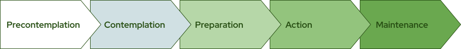

# Institutional Transformation

**Estimated time to complete:** 10 minutes

## Module Learning Objectives

!!! compat ""

    By the end of this module, you will be able to…

    - Define institutional transformation.
    - Argue for an institutional rather than individual approach as necessary for meaningful change in science education.
    - Identify whom to enlist in supporting your ongoing growth as a scientific teacher.
    - Consult a change theory to guide your efforts to engage your colleagues, institution, and/or professional community in scientific teaching.

## Institutional Transformation Defined

Institutional transformation is the process of transforming the culture and practices of a campus to reflect a commitment to key ideals. In scientific teaching, this means cultivating enthusiasm for the intellectual endeavor of teaching and developing practices that recognize and reward teaching innovations and successes.

## Why Institutional Transformation?

Campus cultures set the environment in which post-secondary STEM educators do their work. Like any ecosystem, they provide the physical spaces and resources, as well as, shape the interactions and behaviors of their constituents through their values, processes, and policies. A strong culture of valuing and supporting teaching excellence on a campus maximizes the likelihood that students will experience effective, inclusive learning experiences like those promoted in this book. In that environment, an instructor who adopts scientific teaching would be supported in their endeavors whether they: are content to know that their teaching is based on sound principles; intend to effect change beyond their own classrooms; desire the respect of their colleagues instead of receiving blank stares or belittling comments when they discuss their new teaching approaches; need resources to buy equipment or modify their classrooms in order to implement their teaching plans; or would like scientific teaching methods to be used throughout a course series or departmental curriculum so that students become used to the teaching methods. In this climate, instructors would be supported in their efforts to share their excitement and successes with colleagues to improve teaching throughout their institution. Unfortunately, left to their own devices, institutions of higher learning change very slowly. But we can become agents of change in our classrooms and on our campuses to help build a culture of teaching excellence that will support the learning of all of our students. 

## A Framework for Institutional Transformation

### Stages of Change

Institutional change has been compared with human behavioral change [prochaska1983stages, prochaska2001transtheoretical](@cite). Physicians have delineated the “five stages of change” in human behaviors that patients move through on their way to change health-related behaviors involved in smoking, eating, or exercising. The five stages are described in Figure 6.1. 

Figure adpated from [carnes2005diversity](@cite).

Every campus and the individuals on it are at different stages in this process of change. Some may be in the precontemplation stage, still believing that the way we teach is just fine, (“After all, I learned a lot, didn’t I?”). These colleagues will need to be convinced with different tactics and information than those colleagues in contemplation (“I guess I don’t know whether my teaching methods are effective”) or preparation (“I want to make changes, but I’m not sure how to implement active learning”) stages.

We present the stages of change in a linear model, but just like everything else in scientific teaching, it really is an iterative process of evaluation and revision, of progress and stasis. Feedback, collaboration, and metacognition are hallmarks of each of these models. 

### Common Myths

As you have probably realized from the Scientific Teaching Course, there is no single best way to approach teaching, but certain principles and practices underlie every chapter. Recurring themes in scientific teaching include: integrating learning theory into practice; incorporating the rigor and spirit of scientific scholarship; and using methods that have been tried, tested, and shown to be effective. It is important to be familiar with these themes to be effective at implementing changes; it is equally important to know some common myths so they can be replaced with accurate information. 

There are several myths about scientific teaching concepts. Some of the myths are based on inaccurate information (“Students’ minds are empty vessels”), and some myths are subtle, complex, or only partially wrong (“Students should be self-motivated to learn”). Some of the ideas are alluring in their simplicity (“If I’m not lecturing, then I’m not teaching” or “I treat all students the same in my class”) and others feel uncomfortably true for almost everyone (“There are too few people with too little time to make real change at this campus”). It’s up to each instructor to recognize when these myths arise, and to decide whether to implement strategies for change.

## Institutional Transformation in Practice

Instructors and administrators often want guidance to accelerate and measure the rate of institutional change. This section presents strategies for instructors and administrators to effect changes—small and large—at the local and global levels. A few themes pervade these recommendations. First, data are essential to institutional transformation. Evidence-based arguments are received better by scientists and are easier to defend than opinions, so it is critical to use both review articles and original research studies that document the value of scientific teaching [handelsman_scientific_2004](@cite). Data collected from departments on the campus undergoing transformation are especially powerful: it’s hard to argue against the fact that students on one’s own campus (not some theoretical students in the literature) are learning less than they might be if they were taught differently. Finally, enthusiasm and positive examples propel any movement forward. It is hard to dismiss a colleague who is armed with good values about learning goals, data about student outcomes, excitement, and examples of success.

### Campus Policies

A pervasive myth at research universities is that teaching doesn’t matter, thereby steeping faculty in a culture that places teaching in conflict with research. Consequently, policies, when reinforced by dedicated administrators, can transform campus values and practice. Policies can elevate the importance of teaching as a whole and make clear that the administration values the integration of teaching and research—rather than viewing teaching and research as separate, competing endeavors. For example, allocating 1/3 of merit pay increases to instructional practices sends a message that teaching matters and that it will be rewarded. Tenure guidelines can include strong language to indicate that teaching accomplishments are necessary for tenure and should include a clear description of what teaching criteria will be evaluated. Sabbaticals can be awarded based on proposals to improve teaching or to integrate teaching and research, rather than on research-only plans. Some administrators offer additional new-faculty start-up funds that are designated for teaching. These funds can be used to attend teaching workshops, purchase equipment for student-friendly classrooms, or host educators from other universities to present seminars on teaching. 

### Publicity and Marketing

Administrators can use their positionality to promote the integration of teaching and research and the value of teaching. Presidents and provosts can discuss teaching in speeches, highlighting innovations and why they matter. They can instruct their campus newspaper staff to cover education topics and feature faculty who are recognized for their research as well as teaching. Demonstrating that respected researchers are dedicated to and excel in teaching can influence other senior faculty and sends the message to junior faculty that teaching is held in high esteem by the university’s most influential researchers. 

Deans can advertise their decisions to allocate resources based, in part, on teaching effort and quality, providing funds to support innovation and revamping of old curricula. Department chairs can use these policies to induce their faculty to engage in teaching reform. It is essential that chairs make clear to the entire faculty that the efforts of innovators reflect well on the entire department; when the other faculty notice that their department is recognized and rewarded for teaching innovation, they are more likely to become involved in the reform movement. At the least, they will appreciate the efforts of those who are engaged in the reform.

### Professor-to-Professor Dissemination

Most instructors who engage in education reform are eager to share their newfound knowledge with colleagues. Many are dismayed to find that their colleagues look askance at the new teaching methods and are dismissive in conversations about teaching. Changing faculty behavior is never easy. It can feel Sisyphean—endlessly repetitive, unrewarded, and defeating. But a few strategies have been found more effective than simply telling colleagues about new techniques, which is bound to fail. One of the most effective is team teaching. When colleagues see active learning in action, they can’t deny its power. Students will aid the case because once they become used to active engagement, they will complain about instructors who force them back into the passive mode. Another way to engage colleagues, letting the methods speak for themselves, is to invite peer review. Most colleagues are flattered by being asked to review another’s teaching and everyone benefits: the instructor being reviewed will often gain useful insights, the reviewer will see active learning in action, and the two instructors will begin a dialogue about teaching. Finally, department chairs can invite their faculty to read a book or article about teaching, such as *Leaving the Lectern* [mcmanus2005leaving](@cite) and discuss it at a faculty meeting or faculty retreat.

### Campus Teaching Events

Well-constructed teaching seminars and courses can be transformative. Colleagues who attend them are no doubt far along the change continuum—already in the contemplation stage or beyond and convinced that some change is needed—so this is not a strategy that will work for all colleagues. But for those who are interested and want to learn, this can be a high impact way to reach many instructors. In addition to seminars for faculty, courses for graduate students and postdocs who will be the next generation of faculty are essential ingredients in the recipe for change. In addition to developing good teaching practices themselves, they can be powerful ambassadors for change by informing their advisers and colleagues about what they are learning, thereby enlarging the pool of people affected by the course beyond just those attending it. 

Lastly, the Scientific Teaching Course provides content to engage instructors, faculty, and future faculty in conversations around scientific teaching and to empower them to be agents of change. We suggest leveraging the STC for use in departmental workshops, reading clubs, or communities of practice.
